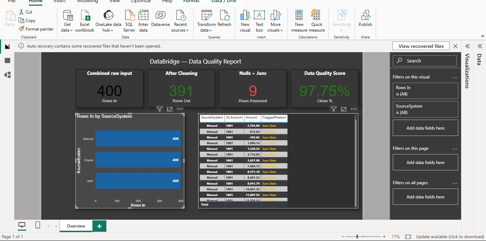

# DataBridge — Multi-Source GL Data Pipeline & Quality Dashboard

A Power BI pipeline that merges three messy GL data sources into one
clean consolidated table and validates data quality with a one-page
audit dashboard.

## Business Problem

Finance teams receive GL transaction exports from multiple systems
(SAP, Oracle, manual entry spreadsheets) with inconsistent column
names, nulls, junk rows, and no unified view. Reconciling these
by hand is error-prone and time-consuming. This project automates
the merge, cleaning, and quality validation in a single pipeline.

## Data

Three real-world-style GL export files across 400 total rows:

- `sap_export.csv` — 130 rows, columns: Acct, Amt, Dt, Cur
- `oracle_export.xlsx` — 130 rows, columns: GL_Account, Value, Posting_Date, Currency_Code
- `manual_entries.csv` — 140 rows, columns: Account, Amount, Date, Currency

Multi-currency (INR / USD / EUR), GL accounts 1001–1006.
manual_entries contained deliberately injected issues: null rows,
`#REF!` errors, and non-parseable junk values.

## Approach

1. All three sources loaded into Power Query; columns renamed to a
   unified schema (GLAccount, Amount, Date, Currency)
2. A `SourceSystem` column added to each query before appending
3. Queries stacked into one `CombinedData` table using Append Queries
4. Cleaning steps applied: trim whitespace, remove rows with null
   GLAccount or null Amount, remove duplicates
5. A parallel `FlaggedRows` query preserves removed rows with a
   `FlaggedReason` column for audit trail
6. Four DAX measures built: Rows In, Rows Out, Rows Removed, Clean %
7. One-page Power BI dashboard: KPI cards, bar chart by source,
   flagged rows table

## Key Findings

- **400** raw rows combined across all three sources
- **9** rows removed — all from `manual_entries.csv`
- Issues: 6 fully null rows, 3 rows with null Account or Amount
- SAP and Oracle exports were clean with zero null or duplicate rows
- Final clean row count: **391**
- Final data quality score: **97.75%**

## Tools

Power BI Desktop · Power Query (M) · DAX · Excel · CSV

## Dashboard

